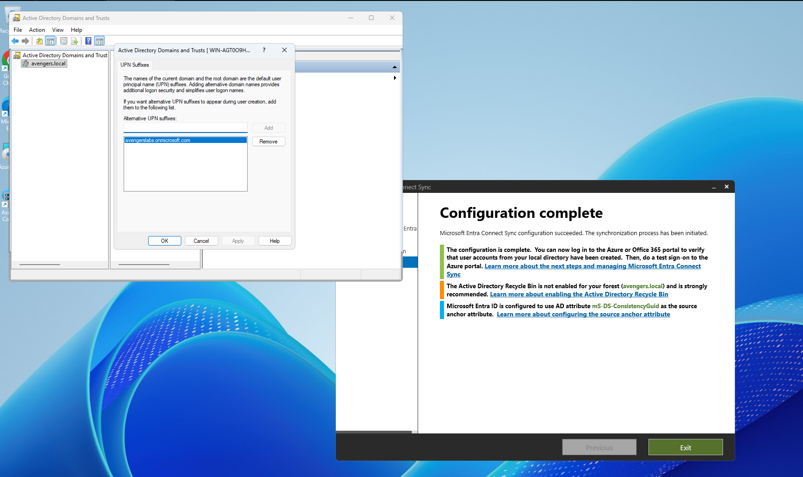

# Windows Server 2025 Hybrid Identity Lab Documentation

## 🔄 Microsoft Entra Connect Deployment & Initial Core Sync

📂 Click to expand regarding alternative UPN configuration and initial directory sync

 

* **Alternative UPN Suffix Registration**
  * Added the verified cloud domain **`://onmicrosoft.com`** as an alternative User Principal Name (UPN) suffix within the **Active Directory Domains and Trusts** console (`WIN-AGTO09H...`). This ensures local user login IDs align perfectly with their cloud identities to facilitate seamless single sign-on (SSO).
  

    
     
    <em>Figure 1: Registering the cloud tenant routing domain as a valid on-premises authentication suffix.</em>
  

* **Microsoft Entra Connect Installation**
  * Successfully installed and executed the **Microsoft Entra Connect Sync** wizard (`.msi`) directly on the Windows Server 2025 Domain Controller. The configuration completed successfully, provisioning the local directory schema to map anchor attributes using `mS-DS-ConsistencyGuid`.
  

    
     
    <em>Figure 2: Successful initial deployment and synchronization pass of the Entra Connect setup wizard.</em>
  

* **Manual Delta Synchronization Execution**
  * Triggered an immediate synchronization sequence from an administrative **Windows PowerShell** console. Executing the **`Start-ADSyncSyncCycle -PolicyType Delta`** cmdlet returned a status of **`Success`**, forcing an immediate replication path to the cloud.
  

    
     
    <em>Figure 3: Forcing a delta replication cycle using administrative PowerShell cmdlets to push local database deltas.</em>
  

* **Cloud Identity Provisioning Verification**
  * Validated end-to-end directory synchronization by auditing the **Microsoft 365 Admin Center** under the **Active Users** directory. Local user identities (including `Aaron Judge`, `Bryce Harper`, `Derek Jeter`, etc.) successfully materialized in the cloud tenant, fully populated with their matching `://onmicrosoft.com` UPNs.
  

    
     
    <em>Figure 4: Confirming local directory objects have successfully provisioned as synchronized cloud identities.</em>
  

---

## 🚫 OU Scope Filtering & Non-Syncing Objects

📂 Click to expand regarding OU filtering boundaries and non-syncing directories

 

* **Entra Connect Domain and OU Filtering Rules**
  * Audited the **Domain and OU filtering** policy within the Microsoft Entra Connect configuration. The root topology was set to *Sync selected domains and OUs*. While core structural units under `Avengers Corporate` were checked, an organizational boundary named **`NoSyncUsers`** was explicitly left unchecked.
  

    
     
    <em>Figure 1: Hardening the sync engine scope by selectively filtering out untrusted or non-production OUs.</em>
  

* **Active Directory Object Isolation Isolation**
  * Created a localized testing identity for a user named **`Miguel Cabr...`** inside the non-syncing **`NoSyncUsers`** Organizational Unit (OU) in Active Directory Users and Computers. 
  * Because the parent container falls entirely outside the active scope of the Entra Connect sync rules, the object is explicitly masked from the sync cycle engine. This ensures the account does not provision or materialize inside the active cloud tenant during scheduled delta intervals.
  

    
     
    <em>Figure 2: Verifying object placement within a filtered, non-replicating container inside ADUC.</em>
  

---

## 👥 Hybrid Distribution List Provisioning & Governance

📂 Click to expand regarding distribution group creation and authority mapping

 

* **On-Premises Group Generation**
  * Provisioned a local object named **`avengerreports`** as a global distribution group in Active Directory. To prepare it for cloud synchronization, its Group Scope was targeted as **Universal**, and mandatory mail attributes (`mail`, `mailNickname`, and `proxyAddresses`) were mapped natively via the local Attribute Editor.

* **Membership and Ownership Definition**
  * Assigned structural roles directly from the on-premises console to test attribute flow down. User **`Ken Griffey`** was provisioned into the `managedBy` attribute to serve as the group's owner. Concurrently, **`Bryce Harper`** and **`Mike Trout`** were populated into the local `member` nested multi-value attribute string.

* **Cloud Distribution List Verification**
  * Audited the **Microsoft 365 Admin Center** under **Teams & groups > Active teams and groups > Distribution list** to confirm object arrival. The group `avengerreports` successfully synced, displaying its source as a synchronized on-premises asset.
  * The cloud console accurately inherited the precise parameters set in AD, showing **1 Owner** (`Ken Griffey`) and **2 Members** (`Bryce Harper`, `Mike Trout`).
  * The interface successfully threw a hard validation warning enforcing hybrid lifecycle limits: *"You can only manage this group in your on-premises environment. Use Active Directory Users & Groups or Exchange Admin Center tools to edit or delete this group."*
  

    
     
    <em>Figure 1: Confirming hybrid group synchronization properties, active membership mapping, and cloud write-protection.</em>
  

---

