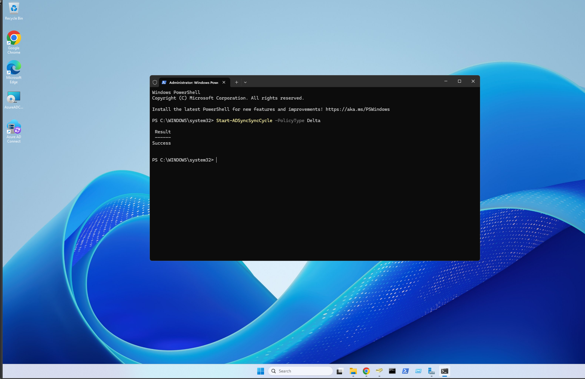
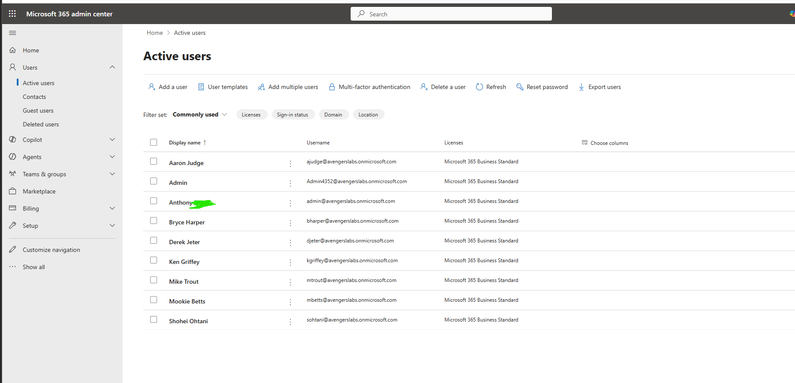
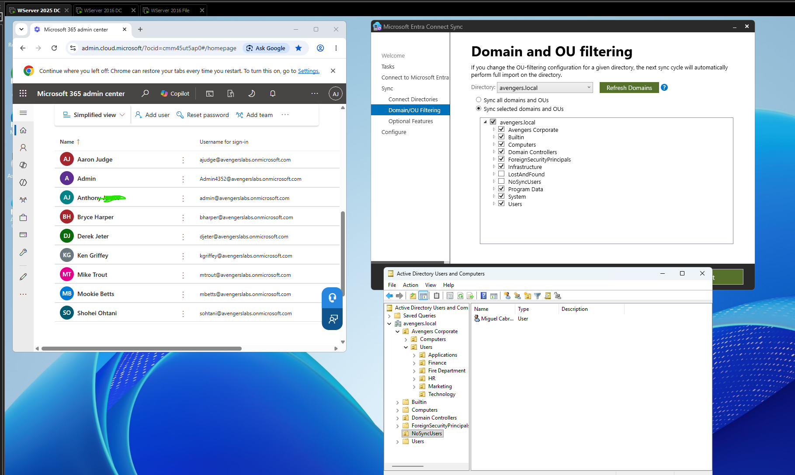
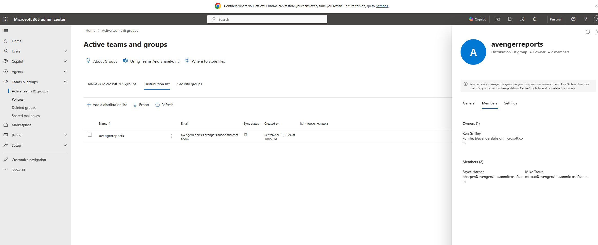

# 365 Admin and Entra Connect Deployment and Details

## 🔄 UPN & Microsoft Entra Connect Deployment

📂 Click to expand regarding alternative UPN configuration and Entra Connect Installation

 

* **Alternative UPN Suffix Registration**
  * Added the verified cloud domain **`://onmicrosoft.com`** as an alternative User Principal Name (UPN) suffix within the **Active Directory Domains and Trusts** console (`WServer 2025 DC`). This ensures local user login IDs align perfectly with their cloud identities to facilitate seamless single sign-on (SSO). Successfully installed and executed the **Microsoft Entra Connect Sync** wizard (`.msi`) directly on the Windows Server 2025 Domain Controller.
  

    
     
    <em>Figure 1: Registering the cloud tenant routing domain as a valid on-premises authentication suffix.</em>
  

* **Manual Delta Synchronization Execution**
  * Triggered an immediate synchronization sequence from an administrative **Windows PowerShell** console. Executing the **`Start-ADSyncSyncCycle -PolicyType Delta`** cmdlet returned a status of **`Success`**, forcing an immediate replication path to the cloud.
  

    
     
    <em>Figure 2: Forcing a delta sync cmd to update 365 portal information quicker.</em>
  

* **Cloud Identity Provisioning Verification**
  * Validated end-to-end directory synchronization by auditing the **Microsoft 365 Admin Center** under the **Active Users** directory. Local user identities (including `Aaron Judge`, `Bryce Harper`, `Derek Jeter`, etc.) successfully materialized in the cloud tenant, fully populated with their matching `://onmicrosoft.com` UPNs.
  

    
     
    <em>Figure 3: Confirming local directory objects have successfully provisioned as synchronized cloud identities.</em>
  

---

## 🚫 OU Scope Filtering & Non-Syncing Objects

📂 Click to expand regarding OU filtering boundaries and non-syncing directories

 

* **Entra Connect Domain and OU Filtering Rules**
  * Audited the **Domain and OU filtering** policy within the Microsoft Entra Connect configuration. The root topology was set to *Sync selected domains and OUs*. While core structural units under `Avengers Corporate` were checked, an organizational boundary named **`NoSyncUsers`** was explicitly left unchecked. After a sync cmd was executed once more, the user Miguel Cabrera was not added to the 365 portal due to him being place into the **`NoSyncUsers`** group
  

    
     
    <em>Figure 1: Hardening the sync engine scope by selectively filtering out untrusted or non-production OUs.</em>
  

---

## 👥 Hybrid Distribution List Provisioning & Management

📂 Click to expand regarding distribution group creation and authority mapping

 

* **On-Premises Group Generation**
  * Provisioned a local object named **`avengerreports`** as a global distribution group in Active Directory. To prepare it for cloud synchronization, its Group Scope was targeted as **Universal**, and mandatory mail attributes (`mail`, `mailNickname`, and `proxyAddresses`) were mapped natively via the local Attribute Editor.

* **Membership and Ownership Definition**
  * Assigned structural roles directly from the on-premises console to test attribute flow down. User **`Ken Griffey`** was provisioned into the `managedBy` attribute to serve as the group's owner. Concurrently, **`Bryce Harper`** and **`Mike Trout`** were populated into the local `member` nested multi-value attribute string.

* **Cloud Distribution List Verification**
  * Audited the **Microsoft 365 Admin Center** under **Teams & groups > Active teams and groups > Distribution list** to confirm object arrival. The group `avengerreports` successfully synced, displaying its source as a synchronized on-premises asset.
  * The cloud console accurately inherited the precise parameters set in AD, showing **1 Owner** (`Ken Griffey`) and **2 Members** (`Bryce Harper`, `Mike Trout`).
  * The interface successfully threw a hard validation warning enforcing hybrid lifecycle limits: *"You can only manage this group in your on-premises environment. Use Active Directory Users & Groups or Exchange Admin Center tools to edit or delete this group."*
  

    
     
    <em>Figure 1: Confirming hybrid group synchronization properties, active membership mapping, and cloud write-protection.</em>
  

---

