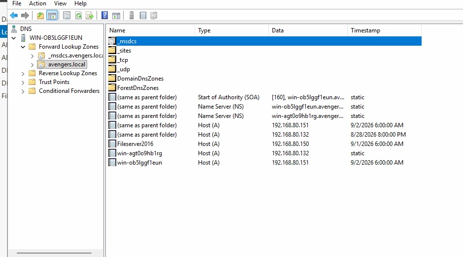
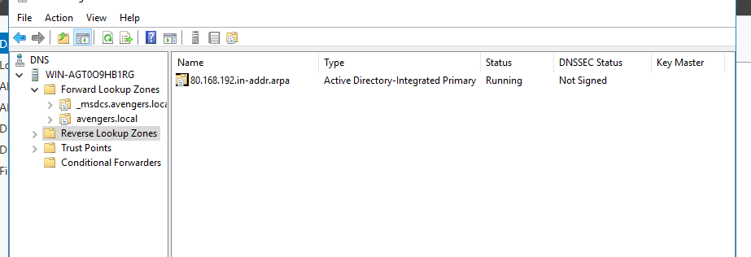

# Windows 11 Server Lab Documentation

## 🌐 DNS

📂 Click to expand regarding actions performed on W11

 

### Overview of Active Directory & DNS Actions
The Windows 11 client machine **DESKTOP-9K4VKO1** was integrated into the enterprise lab environment running under the **avengers.local** domain infrastructure. The system automatically communicated its network profile to the primary Domain Controller (**win-agt0o9hb1rg**), registering its identity across the forwarding database.

### Detailed Actions Performed

* **Dynamic Forward Lookup Registration**
  * A **Host (A)** record was automatically generated inside the primary forward lookup zone (`avengers.local`). The machine bound its unique hostname `DESKTOP-9K4VKO1` to the dynamically assigned IP address **`192.168.80.170`**. A dynamic update lease timestamp was registered on **9/1/2026 at 4:00:00 PM**, proving live communication with the server.
  

    
     
    <em>Figure 1: Verifying active Host (A) records and dynamic update lease timestamps within the forward lookup zone.</em>
  

* **Network Subnet & Reverse Zone Alignment**
  * The client was assigned an address within the `192.168.80.0/24` network range. This matches the exact network boundaries governed by the **Active Directory-Integrated Primary** reverse lookup zone (**`80.168.192.in-addr.arpa`**), establishing the environment for complete, two-way internal network name resolution.
  

    
     
    <em>Figure 2: Viewing the Active Directory-Integrated Primary reverse lookup zone configuration for the local subnet.</em>
  

---

