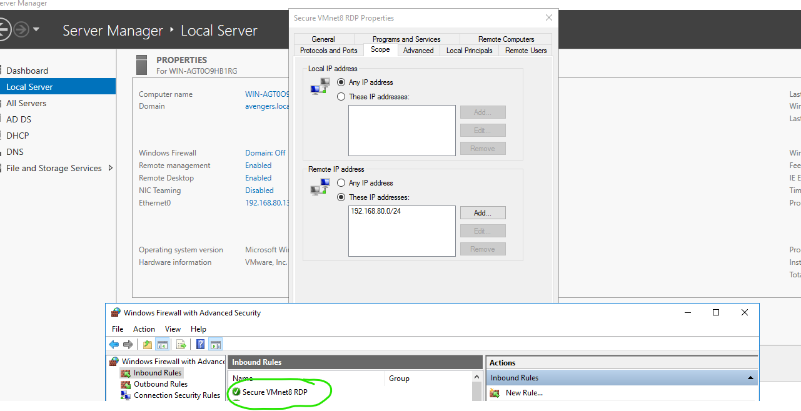
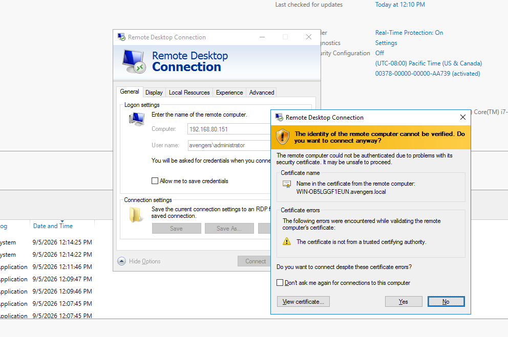
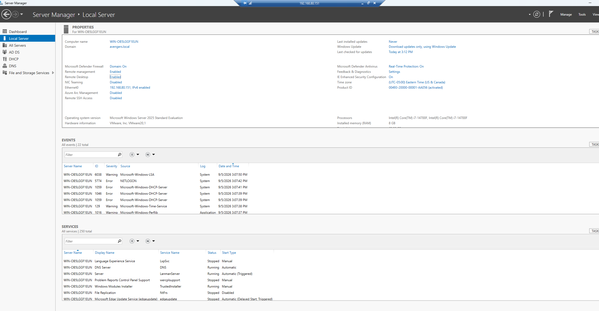

# Windows 11 Server Lab Documentation

## 🌐 DNS

📂 Click to expand regarding actions performed on W11

 

### Detailed Actions Performed

* **Dynamic Forward Lookup Registration**
  * A **Host (A)** record was automatically generated inside the primary forward lookup zone (`avengers.local`). The machine bound its unique hostname `Fileserver2016` to the dynamically assigned IP address **`192.168.80.150`**. A dynamic update lease timestamp was registered on **9/1/2026 at 6:00:00 AM**, proving live communication with the server.
  

    
     
    <em>Figure 1: Verifying active Host (A) records and dynamic update lease timestamps within the forward lookup zone.</em>
  

* **Network Subnet & Reverse Zone Alignment**
  * The client was assigned an address within the `192.168.80.0/24` network range. This matches the exact network boundaries governed by the **Active Directory-Integrated Primary** reverse lookup zone (**`80.168.192.in-addr.arpa`**), establishing the environment for complete, two-way internal network name resolution.
  

    
     
    <em>Figure 2: Viewing the Active Directory-Integrated Primary reverse lookup zone configuration for the local subnet.</em>
  

---

## 🛡️ Windows Defender Firewall

📂 Click to expand regarding firewall rules established on W11

 

### Detailed Actions Performed

* **Default Profile Hardening**
  * Configured the global ingress policy across all three network profiles (**Domain**, **Private**, and **Public**) to explicitly **Block Inbound Connections**. This ensures a default-deny posture where all unsolicited traffic is discarded by default, mitigating lateral network movement vulnerabilities.

* **Scoped Inbound Management Rules**
  * Provisioned a custom inbound firewall rule titled **`Secure VMnet8 RDP`** targeting **TCP Port 3389** to handle remote management requests. To prevent unauthorized traffic from outside the hypervisor sandbox, the remote scope of this rule was restricted explicitly to the internal subnet range (**`192.168.80.0/24`**).
  

    
     
    <em>Figure 3: Configuration of the scoped inbound RDP rule restricting remote access exclusively to the local virtual subnet.</em>
  

---

## 🖥️ Remote Desktop Connection (RDP)

📂 Click to expand regarding cross-DC remote desktop verification

 

### Detailed Actions Performed

* **Remote Desktop Service Activation**
  * Enabled the Remote Desktop feature under the **Server Manager (Local Server)** properties on the target Domain Controller (`WIN-OB5LGGF1EUN` at **`192.168.80.151`**). This transitioned the system status from *Disabled* to **Enabled**, opening up the network stack to listen for incoming session requests on port 3389.

* **Inter-DC Connection & Security Certificate Validation**
  * Initiated an administrative RDP session from the primary management environment to the target DC (`192.168.80.151`) using the domain administrator account (`avengers\administrator`). 
  * The network successfully initiated a handshake, triggering a Windows security warning indicating that the remote host identity could not be verified by a trusted outside root authority. This certificate error confirms that the traffic successfully traversed the local network, cleared the custom firewall rules, and challenged the initiating client for verification before building the secure graphical terminal wrapper.
  

    
     
    <em>Figure 4: Intercepting the self-signed TLS/SSL security certificate from the target DC during connection initialization.</em>
  

* **Successful Remote Session Verification**
  * Upon accepting the certificate authentication prompt, a live remote console session was fully established. The target host's desktop environment was brought into a nested active window inside Server Manager, confirming complete end-to-end functionality, proper domain authentication routing, and the elimination of the previous network timeout errors.
  

    
     
    <em>Figure 5: Active, authenticated cross-DC remote management session operating within the isolated VMnet8 environment.</em>
  

---

