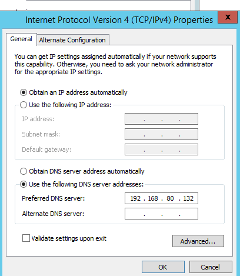
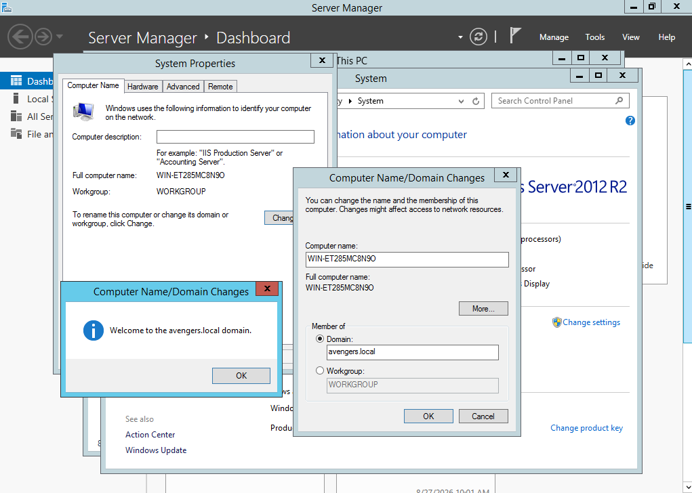
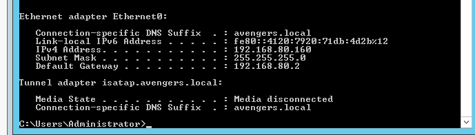
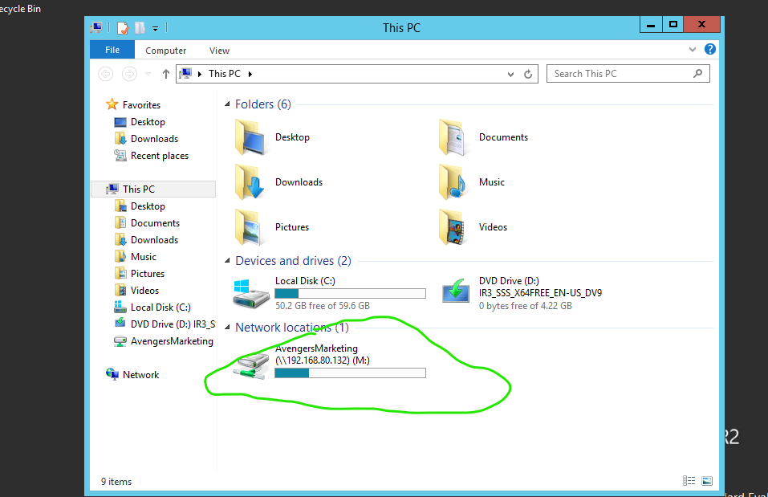

# ⚠️ **IMPORTANT NOTE: THIS SERVER IS NO LONGER IN USE**
### *The information and documentation below will remain active for reference of things completed in this Home Lab!*

---

## 🖥️ Windows Server 2012 R2 Domain Integration

 

📂 Click to expand Domain Join and User Authentication screenshots
 
  

To seamlessly integrate the member server into the sandbox environment, the system configuration was standardized before completing the domain authentication sequence.

### Configuring Computer Name and Domain Settings 

Before initiating the join, the system properties were accessed to transition the server from a standalone workgroup to the target domain layout

 
   
    
  <em>Figure 1: Navigating to System Properties to target the local domain environment by using the IP address of the DC as the Preferred DNS server on Windows 2012.</em> 

 

--- 

### Successful Domain Authentication 

After supplying the required administrative credentials, the server successfully negotiated entry into the infrastructure. 

 
   
    
  <em>Figure 2: Verifying successful domain integration with the avengers.local domain.</em> 

 

---

### Verifying Domain Account Interactive Logon 

To confirm that Active Directory replication and permissions were functioning correctly, an interactive logon session was initiated on the target server. The environment successfully authenticated and loaded the personalized desktop environment for the newly provisioned domain user. 

 
   
    
  <em>Figure 3: Confirming successful session initialization under the 'Mike Trout' domain credentials.</em> 

 

---

## 🌐 DHCP Client Reservation Verification

📂 Click to expand DHCP Lease IP Allocation screenshots

 

### Verification of Persistent DHCP Reservation 

To finalize deployment and guarantee a deterministic network address space, the TCP/IP stack configuration was verified via the command-line interface. Running `ipconfig /all` confirms that the client successfully discarded its automated APIPA configuration and pulled its persistent, reserved lease allocation from the authorized Domain Controller. 

 
   
    
  <em>Figure 1: Verifying the active Ethernet0 network parameters, displaying the successfully assigned 192.168.80.160 IP address and the 'avengers.local' domain suffix.</em> 

 

---

## 💾 Automated Group Policy Drive Mapping

📂 Click to expand Storage Mapped Drive screenshots

 

### Verification of Automated Network Drive Mapping 

To confirm that corporate storage automation and role-based group policies were executing correctly on the client side, File Explorer was reviewed within the active user session. 

Following a logon refresh cycle, the **AvengersMarketing** directory successfully mounted as the **M:** network drive over the secure path `\\192.168.80.132\AvengersMarketing`. This verifies that the Domain Controller evaluated the user's group context properly and cleanly pushed down the shared storage repository.

 
   
    
  <em>Figure 1: Validating the presence of the mapped enterprise storage partition under the Network Locations zone.</em> 

 

