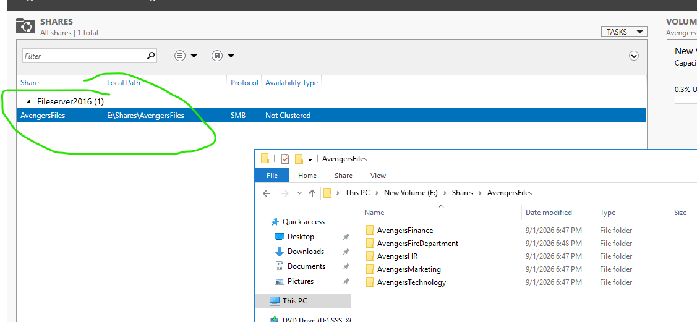
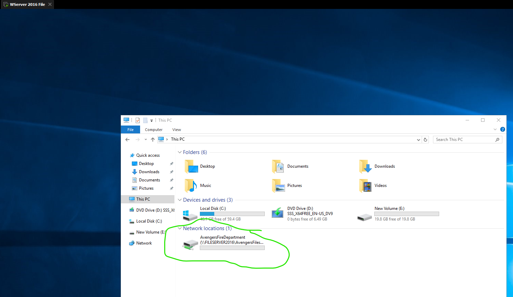

# Windows 2016 File Server

## 🖥️ Windows 2016 File Server Integration

 

📂 Click to view more regarding the Share creation
 
  

To provision centralized storage for the network, an SMB file share named **AvengersFiles** was created on the `FILESERVER2016` member server. As configured in the server tools, this share points locally to `E:\Shares\AvengersFiles` and hosts dedicated sub-folders for each department.

---
 

Using Group Policy Management, a drive mapping policy was configured to automatically mount this directory for authorized users based on their Active Directory groups. When a member of the Fire Department group, such as **Ken Griffey**, logs into a domain workstation, Group Policy successfully pushes the configuration and maps the **AvengersFireDepartment** network location directly to their file explorer.

