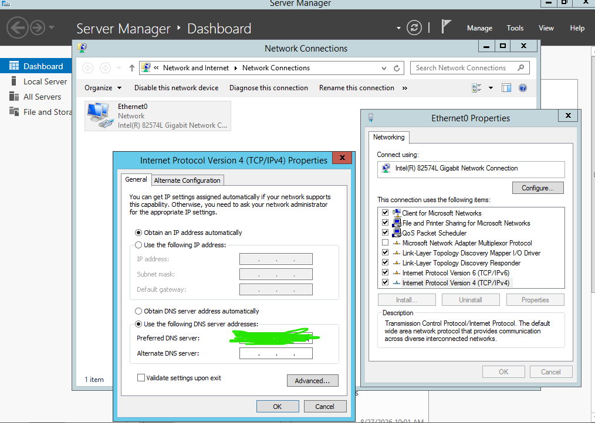
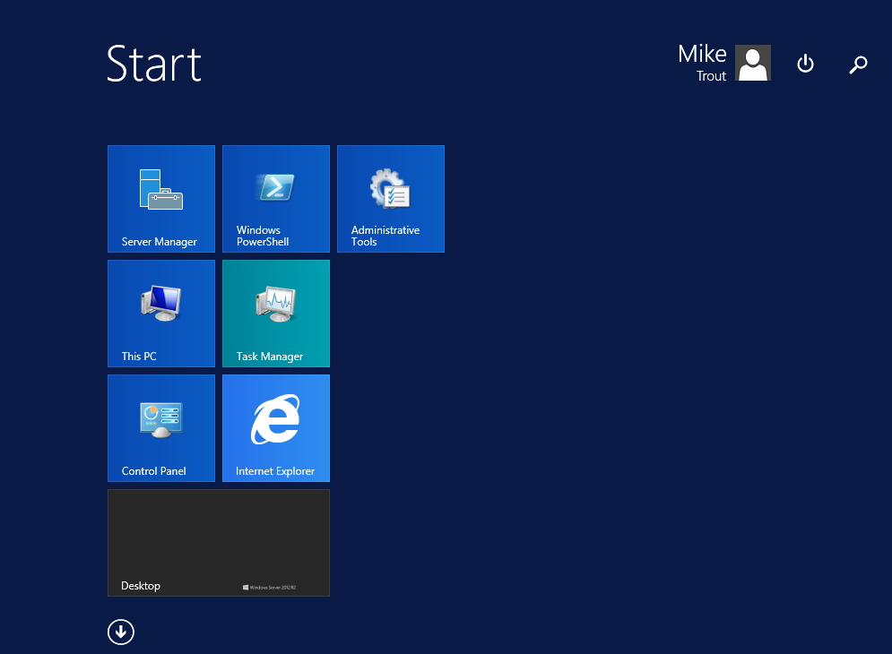

## 🖥️ Windows Server 2012 R2 Deployment 

 

📂 Click to expand Active Directory Domain Join screenshots
 
  
To seamlessly integrate the server into the sandbox environment, the system hostname was standardized before completing the domain authentication sequence. 

### Step 1: Configuring Computer Name and Domain Settings 
Before initiating the join, the system properties were accessed to transition the server from a standalone workgroup to the target domain layout (W11 server). 

 
   
    
  <em>Figure 1: Navigating to System Properties to target the local domain environment by using the IP address of the DC as the Preferred DNS server on Windows 2012.</em> 

 

--- 

### Step 2: Successful Domain Authentication 
After supplying the required administrative credentials, the server successfully negotiated entry into the infrastructure. 

 
   
    
  <em>Figure 2: Verifying successful domain integration with the avengers.local domain.</em> 

 

--- 

### Step 3: Verifying Domain Account Interactive Logon 
To confirm that Active Directory replication and permissions were functioning correctly, an interactive logon session was initiated on the target server. The environment successfully authenticated and loaded the personalized environment for the newly provisioned domain user. 

 
   
    
  <em>Figure 3: Confirming successful session initialization under the 'Mike Trout' domain credentials.</em> 

 

---

### Step 4: Verification of Persistent DHCP Reservation

To finalize deployment and guarantee a deterministic network address space, the TCP/IP stack configuration was verified via the command-line interface. 

Running `ipconfig /all` confirms that the client successfully discarded its automated APIPA configuration and pulled its persistent, reserved lease allocation from the authorized Domain Controller.

 
   
    
  <em>Figure 4: Verifying the active Ethernet0 network parameters, displaying the successfully assigned 192.168.80.160 IP address and the 'avengers.local' domain suffix.</em> 

