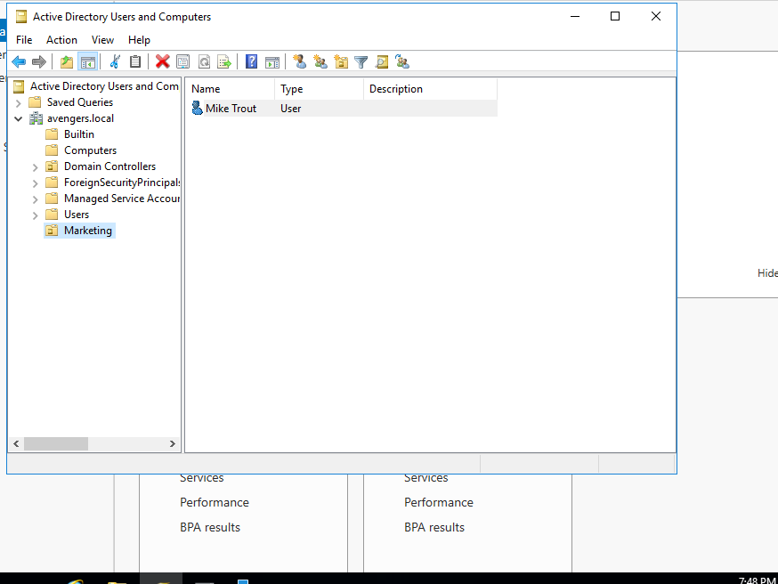
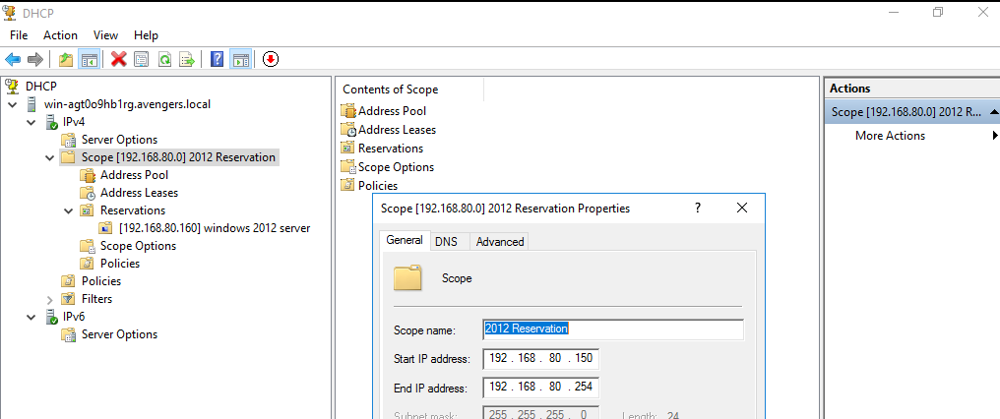
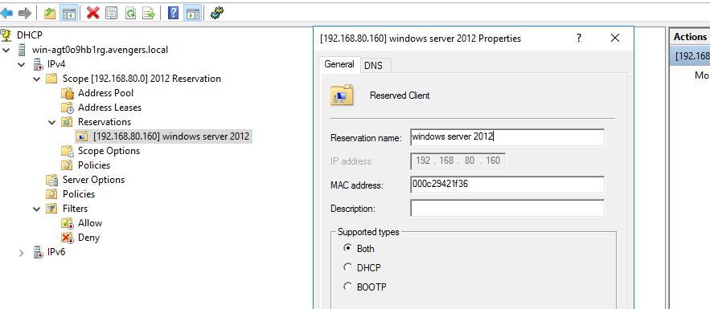

## 🛡️ Windows 2016 Server Information (avengers.local)

 
📂 Click to expand Active Directory Management screenshots
   To organize organization resources and manage corporate identities within the sandbox environment, a structured directory hierarchy was established before provisioning network access.  

Using Active Directory Users and Computers, a new Organizational Unit (OU) called Marketing was created. Followed by the creation of a domain user identity within that container.

 
   
    
  <em>Figure 2: Creating the Marketing OU and populating it with a new user identity (avengers.local).</em> 

---

## 🌐 Windows Server DHCP Infrastructure Configuration

📂 Click to expand DHCP Scope and Client Reservation screenshots

 
To automate IP address distribution and ensure stable networking across the sandbox domain environment, a robust DHCP infrastructure was deployed alongside Active Directory services.
  
Using the DHCP Management Console, a new IPv4 Scope was provisioned for the internal subnet network shown below. To prevent critical server assets from changing IP addresses dynamically, a dedicated MAC-to-IP reservation mapping was applied for the client workload. Leaving 192.168.80.1 - 192.168.80.149 for static infrastructure

  
   
  <em>Figure 3: Configuring the IPv4 dynamic pool distribution range (192.168.80.150 - 192.168.80.254).</em>

---

  
   
  <em>Figure 4: Creating a persistent Reserved Client lease bound to the unique physical MAC address of the target computer (Winodws 2012)</em>

