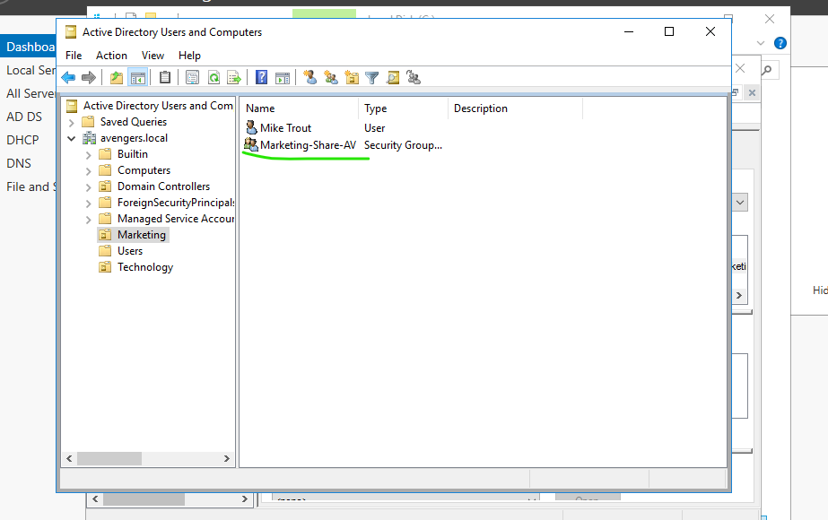
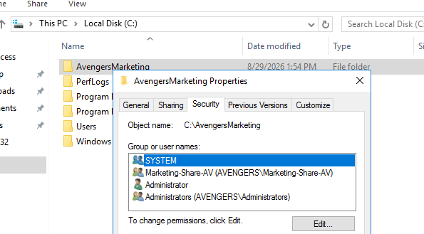
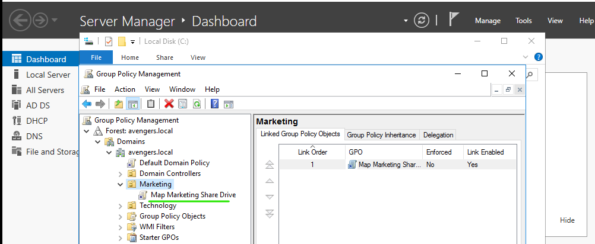
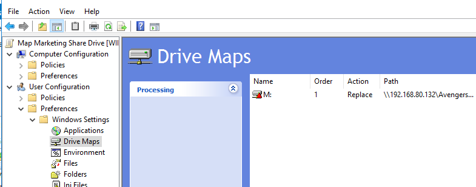

### Domain Controller (DC) Avengers.local

## 🛡️ Windows 2016 Server Information (avengers.local)

 

📂 Click to expand Active Directory Management screenshots
 
  
To organize organization resources and manage corporate identities within the sandbox environment, a structured directory hierarchy was established before provisioning network access.
   
Using Active Directory Users and Computers, a new Organizational Unit (OU) called Marketing was created. Followed by the creation of a domain user identity within that container. 

 
   
    
  <em>Figure 1: Creating the Marketing OU and populating it with a new user identity (avengers.local).</em> 

 

---

## 🌐 Windows Server DHCP Infrastructure Configuration

 

📂 Click to expand DHCP Scope and Client Reservation screenshots
 
  
To automate IP address distribution and ensure stable networking across the sandbox domain environment, a robust DHCP infrastructure was deployed alongside Active Directory services. 
   
Using the DHCP Management Console, a new IPv4 Scope was provisioned for the internal subnet network shown below. To prevent critical server assets from changing IP addresses dynamically, a dedicated MAC-to-IP reservation mapping was applied for the client workload, leaving 192.168.80.1 - 192.168.80.149 for static infrastructure.

 
   
    
  <em>Figure 2: Configuring the IPv4 dynamic pool distribution range (192.168.80.150 - 192.168.80.254).</em> 

 

--- 

 
   
    
  <em>Figure 3: Creating a persistent Reserved Client lease bound to the unique physical MAC address of the target computer (Windows 2012).</em> 

 

---

## 💾 Security Group & GPO Drive Map Automation 

 

📂 Click to expand Storage Security and Group Policy screenshots
 
  
To enforce role-based access control (RBAC) across the domain environment, network storage was provisioned and secured using a dual-layer authentication structure (NTFS and Share permissions) before deploying automated client drive mappings via Group Policy Preferences (GPP). 

### Step 1: Security Group & Directory Hierarchy Creation
To lay the foundation for role-based delegation, a new global Active Directory Security Group named `Marketing-Share-AV` was provisioned directly within the **Marketing OU**. The newly created target domain user profile (`Mike Trout`) was then nested inside this group container. This ensures that permissions are cleanly managed at the group identity level rather than assigned individually.

 
   
    
  <em>Figure 4: Creating the corporate Security Group and structuring organizational identities within the Marketing OU.</em> 

 

--- 

### Step 2: Local Directory Hardening & NTFS Provisioning
Concurrently, a local folder structure (`C:\AvengersMarketing`) was created on the system drive (for testing purposes instead of a virtual D: Data drive) of the Domain Controller to act as the primary share target. Local NTFS file system permissions were explicitly hardened, assigning the newly created `Marketing-Share-AV` security group **Modify, Read & Execute, List Folder Contents, Read, and Write** capabilities while stripping out generic unauthenticated local access.

 
   
    
  <em>Figure 5: Hardening local NTFS directory structures to match corporate Security Group scopes.</em> 

 

--- 

### Step 3: Directory Services Policy Mapping
Within the **Group Policy Management Console**, a dedicated Group Policy Object (GPO) titled **"Map Marketing Share Drive"** was generated and explicitly linked directly to the root of the **Marketing OU** container. This scoping ensures that the network layout policy only targets and executes for identities residing inside this specific business unit.

 
   
    
  <em>Figure 6: Associating the drive mapping policy directly with the target corporate Organizational Unit.</em> 

 

--- 

### Step 4: Group Policy Preference Orchestration
Using the Group Policy Management Editor, the automated workspace layout was configured strictly under the **User Configuration** preference path. To resolve active session conflicts and clear hidden credential blocks, the execution action was set to **Replace**, mapping the target UNC network path (`\\192.168.80.132\AvengersMarketing`) to the client workspace under the persistent drive letter identity **M:**.

 
   
    
  <em>Figure 7: Deploying a 'Replace' action mapping preference under the User context path to ensure automated connection reliability.</em> 

 

